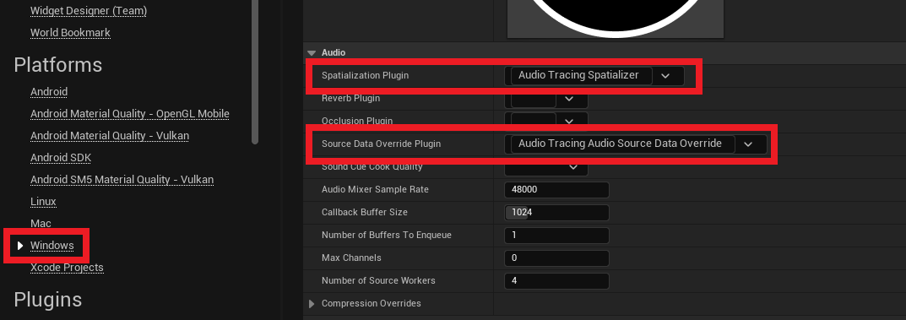
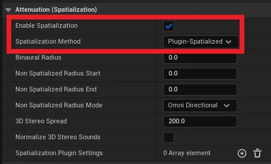
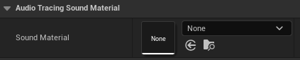
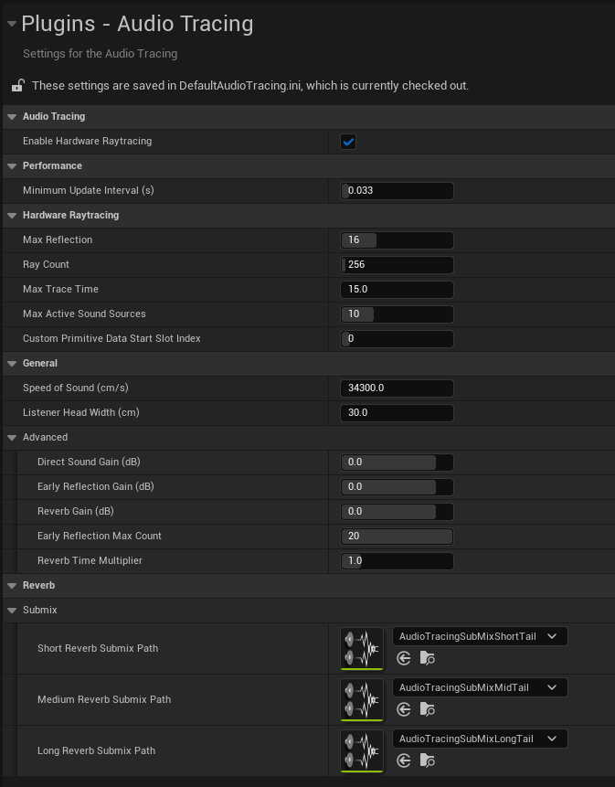

# **Audio Tracing**

## **Hardware-accelerated ray tracing plugin for audio simulation.**

**Audio Tracing** is a plugin that integrates **real-time Ray Tracing technology** into Unreal Engine's **Sound system** with the goal of achieving more realistic **sound propagation simulation**. It physically calculates complex acoustic properties—such as the position, direction, and reflections of sound sources within a real-time, changing game environment—and applies them to the listener, providing a **realistic and spatial sound experience**.

This plugin automatically calculates sound reflections and occlusion via real-time ray tracing. This approach makes it possible to implement realistic sound variations based solely on the world's geometry, without the need to set up separate audio occlusion volumes or complex Blueprint logic.

Users can apply Audio Tracing to existing sounds with **only minimal modifications**, as it is compatible with Unreal Engine's existing Sound Asset system, including SoundCues and MetaSounds.

Additionally, the Sound Material feature allows for detailed adjustment of the acoustic properties of each surface. You can **specifically define the acoustic response of each surface** by individually setting scattering coefficients, reflectivity, and absorption coefficients for materials such as wood, glass, and concrete.

# Recommended Specifications

- A DirectX 12 compatible graphics card with support for ray tracing is required.

- Specifications used for development:
    - CPU: Intel i7-14700 2.10GHz
    - GPU: NVIDIA GeForce RTX 4060
    - Memory: 32GB
    - Graphics RAM: 8GB

- Recommended Specifications

| | | |
| --- | --- | --- |
| OS | Windows 10 64-bit (20H2 or later) or Windows 11 | DirectX 12 compatible |
| CPU | Intel i5-13600K or higher AMD Ryzen 7 5700X or higher | Stable multithreaded parallel processing for Ray → AudioParam on 8-core or hybrid P-core/E-core CPUs. |
| GPU | NVIDIA RTX 4060 or higher AMD RX 7700 XT or higher | Capable of calculating complex bounce paths and simultaneous Scene GI + Audio RT operations. |
| RAM | 32GB | Stable processing of multiple Submixes + MetaSounds and their effects simultaneously. |

# How to Apply Audio Tracing Plugin

- You have to follow 4 steps for apply Audio Tracing plugin.

## 1. Enable Hardware Ray Tracing

- Project Settings → Engine → Rendering
- Check `Support Hardware Ray Tracing` and Check `Use Hardeware Ray Tracing when available`
- Audio Tracing work under UE Hardware Ray Tracing system

- Must use Lumen Global Illumination or Reflections. (At least, one of them needs to use Lumen)

- If there is a Post Process Volume in your scene, also check its `Global Illumination` and `Reflections` settings.

## 2. Apply Plugin on Project Settings

- Project Settings → Platforms → Windows → Audio (Only support Windows)
- Change `Spatialization Plugin` to `Audio Tracing Spatializer`
- Change `Source Data Override Plugin` to `AudioTracingAudioSourceDataOverride`

## 3. Attach  Audio Tracing Listener Component to Pawn

- Attach the `Audio Tracing Listener` component to your Character or Pawn.
- This component serves as the starting point for audio ray tracing in the scene.

## 4. Configuring the 'Sound Attenuation' Asset

- **In the final step,** add a **Sound Attenuation** asset to your sound in order to apply spatialization and plugin-based processing.

- Under the **Attenuation (Spatialization)** section, check `Enable Spatialization`, and set the **Spatialization Method** to `Plugin-Spatialized`.

- Under the **Attenuation (Source Data Override)** section, check `Enable Source Data Override` so that the plugin can use the audio for post-processing.

# Audio Tracing Sound Material Component

- **Audio Tracing** supports the use of custom **Sound Materials** that can be assigned to environmental objects.
These materials enable accurate simulation of acoustic interactions such as reflection, scattering, and absorption based on the physical properties of each surface.

- Attach an `Audio Tracing Sound Material` to the object to be used at the level.
- `Audio Tracing Sound Material` must be placed under a **Primitive Component**. If not, the material will not function correctly.

- `Audio Tracing Sound Material` has 3 attribute.
- **Scattering Factor**: Determines the directionality of reflected sound. It controls the ratio between mirror-like (specular) reflections, which bounce at a predictable angle, and scattered (diffuse) reflections, which travel in many random directions.
    - **0.0**: Perfect specular reflection (like a mirror).
    - **1.0**: Perfect diffuse reflection (scatters evenly in all directions).
- **Reflection Factor**: The fraction of sound energy that is reflected when it hits a surface. This value determines how much sound "bounces off" the material.
    - **1.0**: Reflects all energy (hard, smooth surfaces like marble).
    - **0.0**: Absorbs all energy (soft, porous surfaces like heavy curtains or acoustic foam).
- **Absorption Coefficient (per cm)**: Defines the amount of energy lost for each centimeter the sound travels *through* the material. This is used to calculate sound occlusion and transmission.
    - **Higher values**: Denser materials that block more sound (e.g., concrete).
    - **A value of 0.0**: Acoustically transparent materials that let sound pass through without energy loss.

> 💡 The absorption coefficient is also influenced by the **scale** of the attached object. The larger the object, the more sound energy is attenuated. Therefore, the final transmission loss is a combination of the coefficient value and the object’s scale in the world. When configuring this parameter, be mindful of both factors to ensure accurate acoustic behavior.

# AudioTracing Environment setting on Project Settings

- The **Audio Tracing Plugin** provides a set of configurable parameters in the **Project Settings**, allowing you to control various aspects of the ray tracing process.
- Ray tracing performance settings can be tuned for different use cases, enabling adaptive sound tracing behavior based on the scenario.

- Hardware RayTracing
    - `Max Reflection` : Defines the maximum number of reflections after being emitted from the listener. Once this limit is reached, the ray will stop and no additional sound paths will be calculated.
    - `Ray Count` : Specifies the total number of rays emitted during the tracing process. Higher values improve the accuracy of sound simulation, but may have a significant performance cost.
    - `Max Trace Time` : Determines the maximum trace time for each ray. As rays travel through the scene, their intensity is attenuated based on distance and time. When this time limit is reached, the sound is considered inaudible and is discarded.
    - `Max Active Sound Sources`: The maximum number of concurrently active sound sources to trace against per frame. When this limit is exceeded, Any sounds beyond this count will fall back to standard audio playback without tracing effects.
    - `Custom Primitive Data Start Slot Index` : Audio Tracing encodes Sound Material data into **Custom Primitive Data**. If your project uses this data elsewhere (e.g., for visual shaders or gameplay logic), you can offset the start slot index to avoid conflicts. 
    As of **Unreal Engine 5.6**, up to **36** custom primitive data values can be stored per object. The Audio Tracing Plugin groups **4 values per slot** , effectively allowing for **9 usable slots [0, 8]**.
    If an invalid slot index is specified, the system will fall back to using the default material.
- General
    - `Speed of Sound (cm/s)` : Defines the speed at which sound propagates through the environment. Lower values simulate slower sound travel, resulting in longer delays between direct and reflected sounds.
    - `Listener Head Width (cm)` : Specifies the distance between the listener's left and right ears. This value affects binaural spatialization and interaural time/level differences used in 3D audio rendering.
- Reverb
    - Audio Tracing uses preconfigured Reverb Submix Assets depending on the spatial characteristics of the environment.
    - The contribution of each reverb type—Short, Medium, and Long—is determined by the estimated RT60 (reverberation time). Internally, the plugin uses fixed RT60 thresholds of 3.0, 7.0, and 15.0 seconds to classify the space.
        - In future versions, this classification will be made dynamic by referencing the **Decay Time** parameter defined within the assigned **Submix Effect Reverb Preset Asset**. This will allow more flexible and accurate control over RT60-based reverb behavior.
    - You may override the default behavior by creating and assigning custom Reverb Submix Assets, allowing you to tailor reverb effects to better fit your sound design.

# Available Console Variables
* AudioTracing.SoundSpeed
* AudioTracing.HeadWidth
* AudioTracing.CustomPrimitiveDataStartSlotIndex
* AudioTracing.ShowDebugVirtualAudio
* AudioTracing.HardwareRayTracing
* AudioTracing.HardwareRayTracing.MaxReflectionDepth
* AudioTracing.HardwareRayTracing.RayTracingNormalBias
* AudioTracing.HardwareRayTracing.MaxTraceTime
* AudioTracing.HardwareRayTracing.MaxActiveSoundSources
* AudioTracing.HardwareRayTracing.DebugSoundMaterial

# Known Issue
- If sound does not propagate correctly in enclosed spaces, make sure that the mesh supports Ray Tracing. AudioTracing relies on the same geometry used for GPU Ray Tracing, so if the mesh does not support it, AudioTracing will not function properly.

-  AudioTracing provides a default Attenuation Asset. Since AudioTracing builds upon Unreal Engine's native Attenuation system to perform post-processing on audio, any custom attenuation effects set by the user will take precedence and be applied before AudioTracing processing.